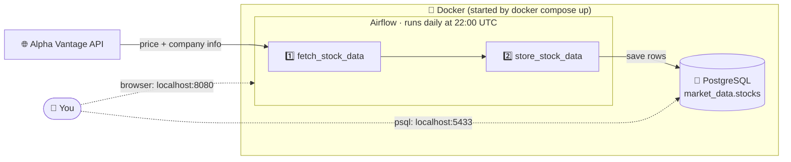
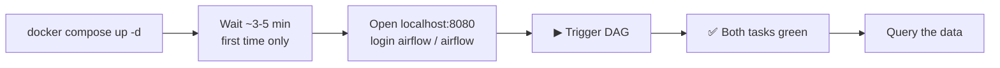
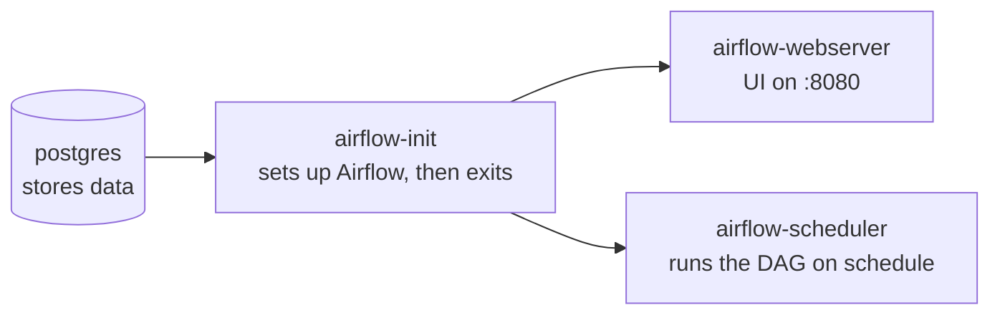
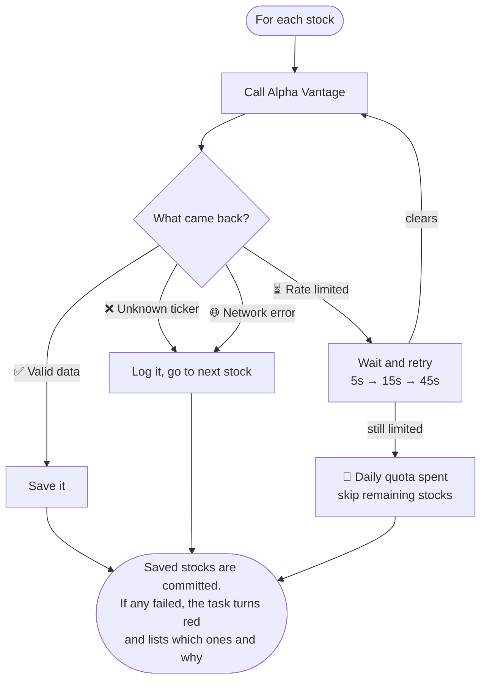

<p align="center">
  
</p>

<h1 align="center">MarketPipe</h1>

<p align="center">
  Fetches daily stock prices from <a href="https://www.alphavantage.co/">Alpha Vantage</a>, stores them in PostgreSQL,
  and runs automatically every day with Apache Airflow.<br>
  <b>One command to start. Runs the same on Windows, macOS, and Linux.</b>
</p>

---

## How it works



1. **Fetch**: for each stock in [`config.json`](config.json) (AAPL, GOOG, MSFT by default), get today's quote and the company details.
2. **Store**: save one row per stock per trading day. Running it again updates the row instead of making a duplicate.

---

## Run it

### Step 1: Install Docker (the only thing you need)

| Your system | Install |
| --- | --- |
| **Windows** | [Docker Desktop](https://docs.docker.com/desktop/setup/install/windows-install/) (turn on WSL 2 when asked) |
| **macOS** (Intel or Apple Silicon) | [Docker Desktop](https://docs.docker.com/desktop/setup/install/mac-install/) |
| **Linux** | [Docker Engine](https://docs.docker.com/engine/install/) + the [Compose plugin](https://docs.docker.com/compose/install/linux/) |

You don't need Python or Postgres on your machine. Everything runs inside Docker.

Make sure Docker is running, then check:

```bash
docker compose version
```

### Step 2: Get the code

```bash
git clone <this-repo-url>
cd MarketPipe
```

No git? Download the ZIP from GitHub, unzip it, and open a terminal inside the folder.

### Step 3: Add your free API key

Get a free key (takes about 20 seconds): **https://www.alphavantage.co/support/#api-key**

Create your `.env` file from the template:

| Terminal | Command |
| --- | --- |
| macOS / Linux / Git Bash | `cp .env.example .env` |
| Windows PowerShell | `Copy-Item .env.example .env` |
| Windows CMD | `copy .env.example .env` |

Open `.env` in any text editor and paste your key:

```ini
ALPHA_API_KEY=your_key_here
```

You can leave everything else in `.env` as it is.

### Step 4: Start it

```bash
docker compose up -d
```

The first start downloads and builds images, which takes **about 3–5 minutes**. Later starts take seconds.

### Step 5: Open Airflow

Go to **http://localhost:8080** and log in with `airflow` / `airflow`.

Find `stock_data_pipeline` and click **▶ Trigger DAG** to run it right away instead of waiting for the daily schedule.
When both tasks turn green, the data is in the database.



### Step 6: See your data

Open a database shell (works in bash, zsh, and PowerShell):

```bash
docker compose exec postgres sh -c 'psql -U $POSTGRES_USER -d $POSTGRES_DB'
```

Then run:

```sql
SELECT symbol, name, trading_day, price, volume FROM market_data.stocks ORDER BY symbol;
```

```
 symbol |         name          | trading_day |  price   |  volume
--------+-----------------------+-------------+----------+----------
 AAPL   | Apple Inc.            | 2026-09-10  | 326.5700 | 70011913
 GOOG   | Alphabet Inc Class C  | 2026-09-10  | 330.3900 | 16418878
 MSFT   | Microsoft Corporation | 2026-09-10  | 492.4400 | 16038805
```

Type `\q` to leave the shell.

### Stop it

```bash
docker compose down       # stop, keep your data
docker compose down -v    # stop and delete all data (fresh start)
```

---

## What's running

`docker compose up` starts four containers, in this order:



Check they are up with `docker compose ps`. Follow the logs with `docker compose logs -f`.

---

## Customize

Everything you'd normally change is in [`config.json`](config.json). You don't need to rebuild anything:

```json
{
  "symbols": ["AAPL", "GOOG", "MSFT", "NVDA"],
  "schedule": "0 22 * * *",
  "retries": 2,
  "retry_delay_minutes": 5
}
```

| Setting | Meaning |
| --- | --- |
| `symbols` | Stock tickers to track |
| `schedule` | When to run, as a [cron expression](https://crontab.guru/#0_22_*_*_*) in UTC |
| `retries` / `retry_delay_minutes` | How often Airflow retries a failed task, and how long it waits between tries |

> **Free-tier limit:** each stock uses 2 API calls, and the free tier allows about 25 calls a day.
> Keep `2 × number of stocks` under your limit. Three stocks use only 6 calls.

---

## When something goes wrong

Each stock is handled on its own, so one bad ticker doesn't stop the others:



You always keep the data that was collected, and a red task in Airflow tells you what was missed.

### Troubleshooting

| Problem | Fix |
| --- | --- |
| `ALPHA_API_KEY is not set` in task logs | Add your key to `.env`, then run `docker compose up -d` again |
| Port **8080** already in use | Stop the other app, or change `"8080:8080"` to e.g. `"8081:8080"` in `docker-compose.yml` and open `localhost:8081` |
| Port **5433** already in use | Set `POSTGRES_HOST_PORT=5434` in `.env` |
| `permission denied` on Linux | Add yourself to the docker group: `sudo usermod -aG docker $USER`, then log out and back in |
| Task fails with "quota exhausted" | You've used today's free API calls. Try again tomorrow, or track fewer stocks |
| Changes to `init.sql` have no effect | The schema is only created the first time. Run `docker compose down -v`, then `up -d` |
| Airflow page won't load | It's probably still starting. Wait a minute and check `docker compose logs -f airflow-webserver` |
| Commands fail in Windows CMD | Use **PowerShell** or **Git Bash** instead |
| Containers keep restarting | Give Docker at least **4 GB of RAM** (Docker Desktop → Settings → Resources) |

---

## Project layout

```
MarketPipe/
├── docker-compose.yml      # Starts everything
├── .env.example            # Template for your settings and API key
├── config.json             # Stocks, schedule, retries
├── dags/
│   └── stock_data_dag.py   # Airflow pipeline: fetch → store
├── core/
│   ├── stock_fetcher.py    # Talks to Alpha Vantage
│   └── storage.py          # Writes to PostgreSQL
├── database_setup/
│   └── init.sql            # Table definition
├── docker/airflow/         # Airflow image and its dependencies
└── tests/                  # Unit tests (no real API or database needed)
```

---

## What gets stored

Table `market_data.stocks`, one row per **stock + trading day**:

| Column | Example | Always filled? |
| --- | --- | --- |
| `symbol`, `name` | `AAPL`, `Apple Inc.` | ✅ |
| `trading_day` | `2026-09-10` | ✅ |
| `price`, `volume` | `326.57`, `70011913` | ✅ |
| `open_price`, `high_price`, `low_price` | `316.67` … | optional |
| `previous_close`, `change_amount`, `change_percent` | … | optional |
| `market_cap` | from company overview | optional |
| `collected_at` | when the pipeline ran | ✅ |

<details>
<summary><b>Design notes</b> (why it's built this way)</summary>

- **Keyed on `trading_day`, not the run date.** A weekend run returns Friday's prices. Keying on the trading day
  means it updates Friday's row instead of storing a copy under the wrong date.
- **Safe to re-run.** `UNIQUE (symbol, trading_day)` plus `INSERT … ON CONFLICT DO UPDATE` means triggering it
  10 times still gives one row per stock per day.
- **Optional fields can be empty.** A quote missing its high/low is still useful, and ETFs have no market cap.
  Only the fields that make a row meaningful are required.
- **Alpha Vantage hides errors in successful responses.** It returns HTTP 200 with an error message inside, so
  every response body is checked before it's used.
- **Two tasks, not one.** An API problem and a database problem show up as different red boxes in Airflow.
- **Credentials stay out of git.** `.env` is git-ignored, and a pre-commit hook blocks accidentally committed keys.

More detail: [`docs/planning/architecture.md`](docs/planning/architecture.md).

</details>

---

## For developers

Run the tests locally (Python **3.9–3.11**; Airflow 2.9 does not support 3.12+):

```bash
python -m venv .venv
source .venv/bin/activate          # Windows: .venv\Scripts\activate
pip install -r requirements.txt
python -m unittest discover tests -v
black .
```

Or run them inside Docker without installing Python:

```bash
docker compose exec airflow-scheduler python -m unittest discover tests -v
```

CI runs the tests and `black --check` on every pull request.

---

## License

See [LICENSE.txt](LICENSE.txt).
