<h1 align="center">Stock-Market Pipeline</h1>

<p align="center">
  Fetches daily stock prices from <a href="https://www.alphavantage.co/">Alpha Vantage</a>, stores them in PostgreSQL,
  and runs automatically every day with Apache Airflow.<br>
  <b>One command to start. Runs the same on Windows, macOS, and Linux.</b>
</p>

<p align="center">
  <a href="#-how-to-run">How to run</a> ·
  <a href="#-screenshots">Screenshots</a> ·
  <a href="#-error-handling">Error handling</a> ·
  <a href="#-troubleshooting">Troubleshooting</a>
</p>

---

## 🧭 How it works

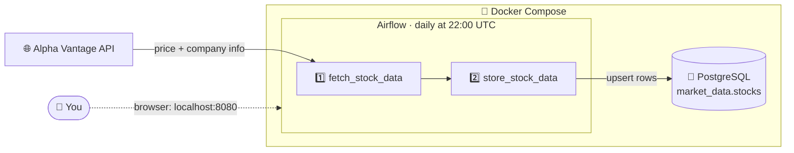

1. **Fetch**: for each ticker in [`config.json`](config.json), get the latest quote and the company details.
2. **Store**: save one row per ticker per trading day. Running it again updates the row instead of making a duplicate.

### One run, step by step

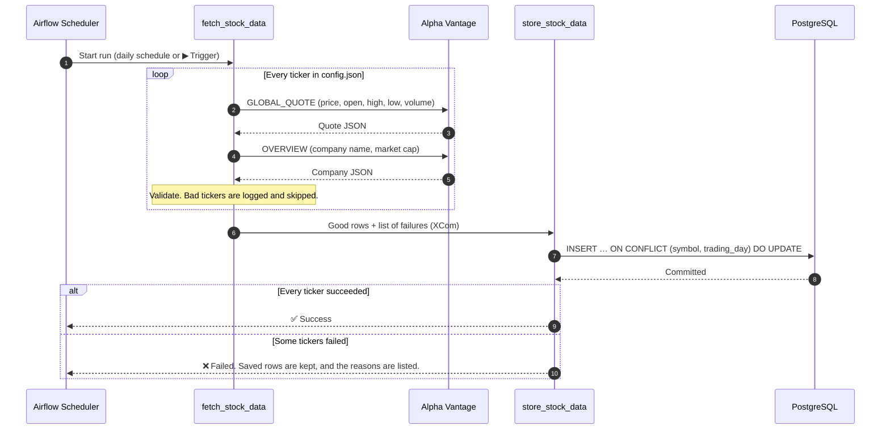

---

## 📸 Screenshots

These are real screenshots from a fresh `docker compose up`.

**The pipeline in Airflow.** The DAG is on and scheduled, with no manual setup:

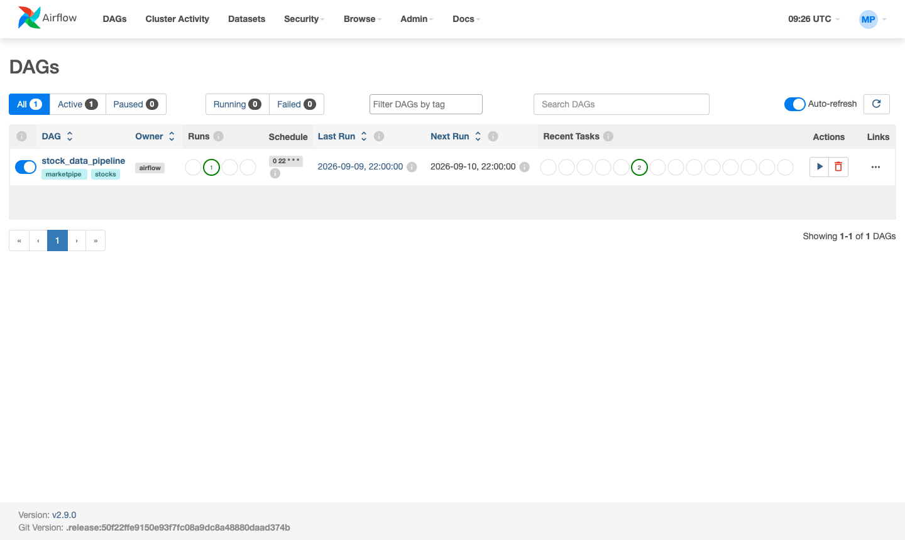

**A successful run.** Both tasks are green:

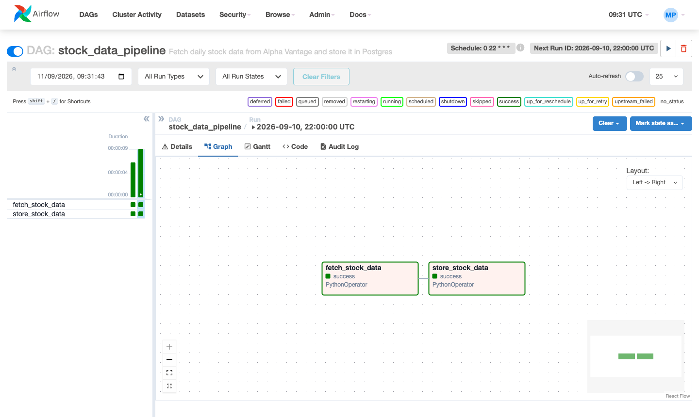

**Fetch log.** It shows every value it received:

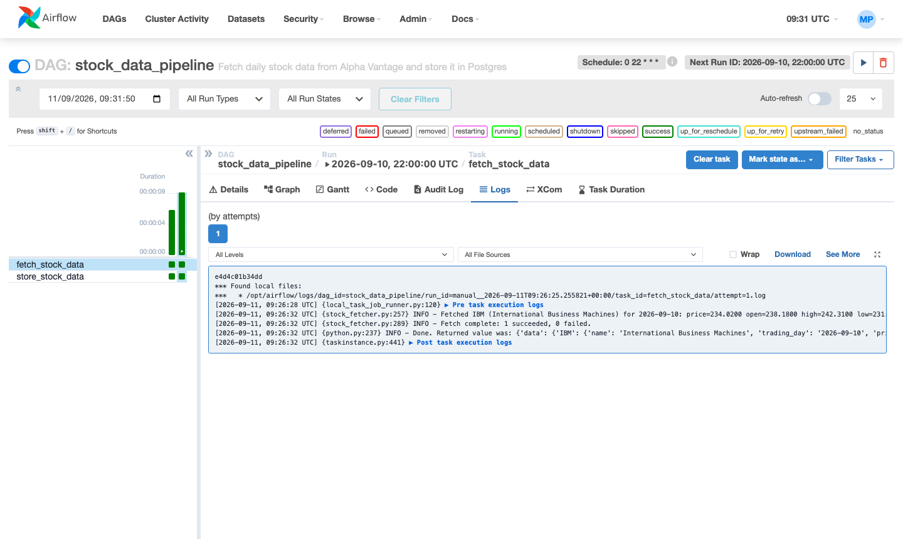

**Store log.** The row is written to PostgreSQL:

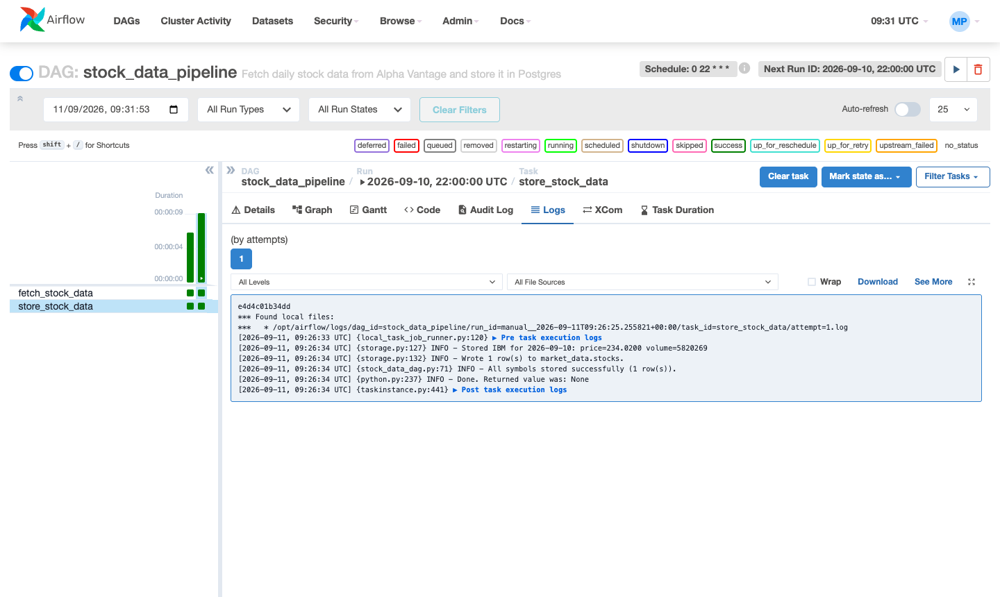

**The data in PostgreSQL:**

```
 symbol |              name               | trading_day |  price   | open_price | high_price | low_price | change_percent | volume
--------+---------------------------------+-------------+----------+------------+------------+-----------+----------------+---------
 IBM    | International Business Machines | 2026-09-10  | 234.0200 |   238.1800 |   242.3100 |  231.8300 |        -2.4673 | 5820269
```

Triggering it twice still leaves **1 row**, because writes are idempotent.

<details>
<summary><b>Screenshots of error handling</b> (the API's daily quota ran out)</summary>

**Fetch:** it backs off 5s → 15s → 45s, then decides the quota is spent. The API key is masked as `***` in the log.

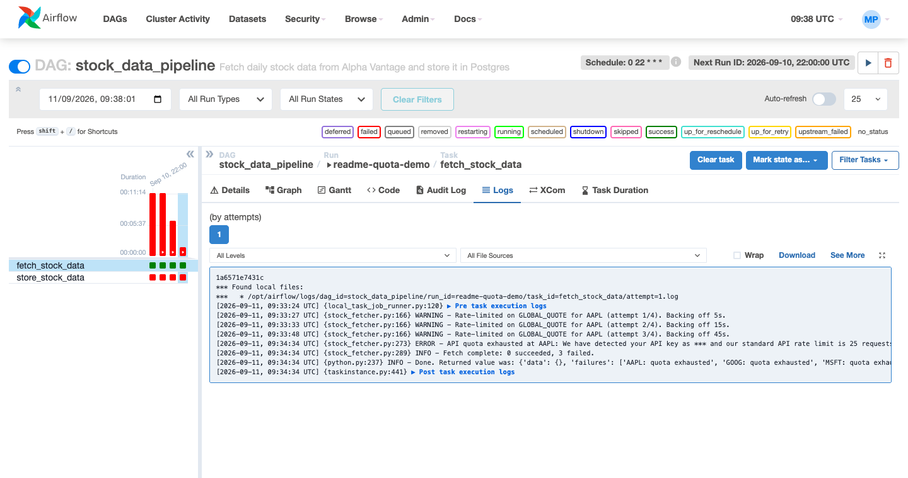

**Store:** the task fails right away with a clear reason, and doesn't waste time on retries.

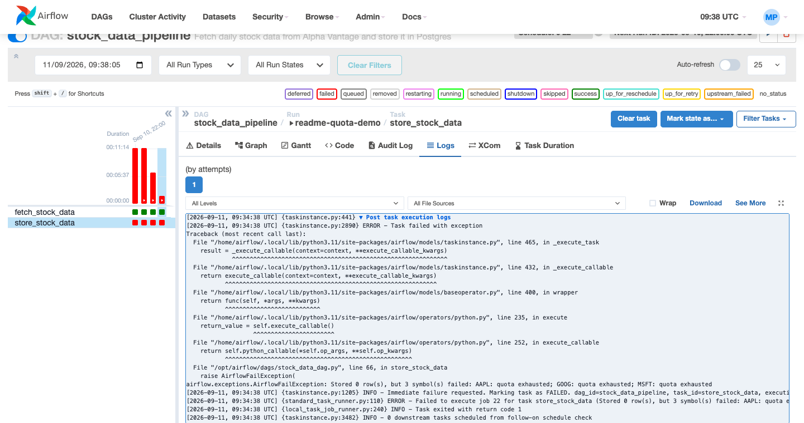

</details>

---

## ✅ Deliverables

| Deliverable | File |
| --- | --- |
| Docker Compose: builds and runs everything | [`docker-compose.yml`](docker-compose.yml) |
| Orchestrator logic: the Airflow DAG | [`dags/stock_data_dag.py`](dags/stock_data_dag.py) |
| Data fetching: calls the API and parses the response | [`core/stock_fetcher.py`](core/stock_fetcher.py) |
| Database update: upserts into PostgreSQL | [`core/storage.py`](core/storage.py) |
| Instructions | this README |

| Evaluation criterion | How it's met |
| --- | --- |
| **Correctness** | Every field from the API is stored with its full precision. The key is `(symbol, trading_day)`, so a weekend run can't store Friday's prices under the wrong date. |
| **Error handling** | Quota, bad ticker, network, missing fields, and database errors are each handled differently. See [Error handling](#-error-handling). |
| **Scalability** | Add tickers or change the schedule in `config.json` with no code change. Writes are idempotent, so re-runs are safe. Switching to `CeleryExecutor` for parallel workers is a config change. |
| **Code quality** | Small modules, type hints, docstrings, 39 unit tests, `black` formatting, CI on every PR. |
| **Dockerization** | Only Docker is needed. One command starts it, health checks set the start-up order, and nothing is installed on your machine. |

---

## 🚀 How to run

### 1. Install Docker (the only requirement)

| Your system | Install |
| --- | --- |
| **Windows** | [Docker Desktop](https://docs.docker.com/desktop/setup/install/windows-install/) (turn on WSL 2 when asked) |
| **macOS** (Intel or Apple Silicon) | [Docker Desktop](https://docs.docker.com/desktop/setup/install/mac-install/) |
| **Linux** | [Docker Engine](https://docs.docker.com/engine/install/) + the [Compose plugin](https://docs.docker.com/compose/install/linux/) |

You don't need Python or Postgres on your machine. Start Docker, then check it works:

```bash
docker compose version
```

### 2. Get the code

```bash
git clone https://github.com/kazuma761/Stock-market/tree/cooled
cd MarketPipe
```

No git? Download the ZIP, unzip it, and open a terminal inside the folder.

### 3. Add your API key

Create your `.env` file from the template:

| Terminal | Command |
| --- | --- |
| macOS / Linux / Git Bash | `cp .env.example .env` |
| Windows PowerShell | `Copy-Item .env.example .env` |

Open `.env` in any text editor and set your key. You can leave everything else as it is.

```ini
ALPHA_API_KEY=your_key_here
```

Get a free key in about 20 seconds at **https://www.alphavantage.co/support/#api-key**.

> **Just want to try it right now?** Use Alpha Vantage's public demo key. It only works for IBM:
> set `ALPHA_API_KEY=demo` in `.env`, and set `"symbols": ["IBM"]` in `config.json`.

### 4. Start it

```bash
docker compose up -d
```

The first start builds the image and takes **about 3–5 minutes**. Later starts take seconds.

### 5. Open Airflow

Go to **http://localhost:8080** and log in with `airflow` / `airflow`.

The pipeline runs once by itself on the first start. To run it again, open `stock_data_pipeline` and click
**▶ Trigger DAG**. When both tasks turn green, the data is saved.

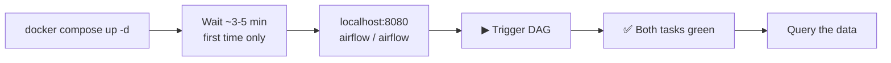

### 6. See your data

Open a database shell. This works in bash, zsh, and PowerShell:

```bash
docker compose exec postgres sh -c 'psql -U $POSTGRES_USER -d $POSTGRES_DB'
```

Then run:

```sql
SELECT symbol, name, trading_day, price, volume FROM market_data.stocks ORDER BY symbol;
```

Type `\q` to leave.

### 7. Stop it

```bash
docker compose down       # stop, keep your data
docker compose down -v    # stop and delete all data (fresh start)
```

---

## 🏃 What's running

`docker compose up` starts four containers, in this order:

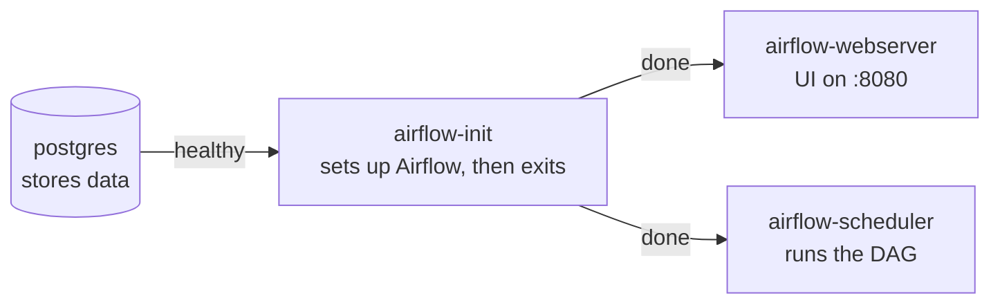

| Command | What it does |
| --- | --- |
| `docker compose ps` | Shows which containers are up |
| `docker compose logs -f` | Follows the logs live |
| `docker compose exec airflow-scheduler airflow dags trigger stock_data_pipeline` | Triggers a run without the UI |

Postgres isn't published on a host port. Everything reaches it inside Docker, so it can't clash with a Postgres
you already have installed.

---

## ⚙️ Customize

Change these in [`config.json`](config.json). You don't need to rebuild anything:

```json
{
  "symbols": ["AAPL", "GOOG", "MSFT"],
  "schedule": "0 22 * * *",
  "retries": 2,
  "retry_delay_minutes": 5
}
```

| Setting | Meaning |
| --- | --- |
| `symbols` | Tickers to track |
| `schedule` | When to run, as a [cron expression](https://crontab.guru/#0_22_*_*_*) in UTC |
| `retries` / `retry_delay_minutes` | How often Airflow retries a failed database write, and how long it waits between tries |

> **Free-tier limit:** each ticker uses 2 API calls, and the free tier allows 25 calls a day.
> Keep `2 × tickers` under 25 per day, including any manual runs.

---

## 🛡️ Error handling

Each ticker is handled on its own, so one problem doesn't stop the others:

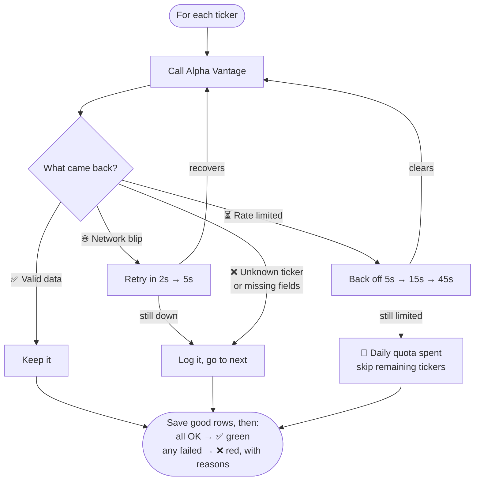

| Problem | What happens |
| --- | --- |
| **Rate limit or daily quota** | The API reports these inside a normal `HTTP 200` response, so every response body is checked. It backs off and retries. If the limit doesn't clear, the quota is spent, and it stops calling the API instead of burning more requests. |
| **Unknown ticker** | That ticker is logged and skipped, and the others continue. |
| **Network error or timeout** | Retried inside the fetch step, which is the only place a retry can actually fetch again. |
| **Missing fields** | Required fields (price, volume, date, name) are checked, and the ticker is skipped if any are missing. Optional fields (high, low, market cap…) are stored as `NULL`, so the row is kept. |
| **Database down** | The transaction rolls back, and Airflow retries the write step twice, 5 minutes apart. |
| **API key in error messages** | Masked as `***` before anything is logged, because Alpha Vantage repeats your key back in its error messages. |

Good rows are always saved before the task reports a failure. You keep what was collected, and the red task
tells you what was missed.

---

## 🔧 Troubleshooting

| Problem | Fix |
| --- | --- |
| `ALPHA_API_KEY is not set` in task logs | Add your key to `.env`, then run `docker compose up -d` again |
| Port **8080** already in use | Set `AIRFLOW_PORT=8081` in `.env` and open `localhost:8081` |
| `permission denied` on Linux | `sudo usermod -aG docker $USER`, then log out and back in |
| Task fails with `quota exhausted` | You've used today's 25 free calls. Try again tomorrow, track fewer tickers, or use the `demo` key |
| Changes to `init.sql` have no effect | The schema is only created the first time. Run `docker compose down -v`, then `up -d` |
| Airflow page won't load | It's still starting. Wait a minute and check `docker compose logs -f airflow-webserver` |
| Commands fail in Windows CMD | Use **PowerShell** or **Git Bash** |
| Containers keep restarting | Give Docker at least **4 GB of RAM** (Docker Desktop → Settings → Resources) |

---

## 📁 Project layout

```
MarketPipe/
├── docker-compose.yml      # Starts everything
├── .env.example            # Template for settings and the API key
├── config.json             # Tickers, schedule, retries
├── dags/
│   └── stock_data_dag.py   # Airflow pipeline: fetch → store
├── core/
│   ├── stock_fetcher.py    # Talks to Alpha Vantage, handles API errors
│   └── storage.py          # Upserts into PostgreSQL
├── database_setup/
│   └── init.sql            # Table definition
├── docker/airflow/         # Airflow image and its dependencies
├── assets/screenshots/     # Images used in this README
└── tests/                  # Unit tests (no real API or database needed)
```

### What gets stored

Table `market_data.stocks`, one row per **ticker + trading day**:

| Column | Example | Always filled? |
| --- | --- | --- |
| `symbol`, `name` | `IBM`, `International Business Machines` | ✅ |
| `trading_day` | `2026-09-10` | ✅ |
| `price`, `volume` | `234.02`, `5820269` | ✅ |
| `open_price`, `high_price`, `low_price` | `238.18`, `242.31`, `231.83` | optional |
| `previous_close`, `change_amount`, `change_percent` | `239.94`, `-5.92`, `-2.4673` | optional |
| `market_cap` | from company overview | optional |
| `collected_at` | when the pipeline ran | ✅ |

---

## 🧪 For developers

Run the tests inside Docker, with nothing to install:

```bash
docker compose exec airflow-scheduler python -m unittest discover tests -v
```

Or run them locally (Python **3.9–3.11**; Airflow 2.9 does not support 3.12+):

```bash
python -m venv .venv
source .venv/bin/activate          # Windows: .venv\Scripts\activate
pip install -r requirements.txt
python -m unittest discover tests -v
black .
```

CI runs the tests and `black --check` on every pull request.
Design notes: [`docs/planning/architecture.md`](docs/planning/architecture.md).

---

## License

See [LICENSE.txt](LICENSE.txt).
