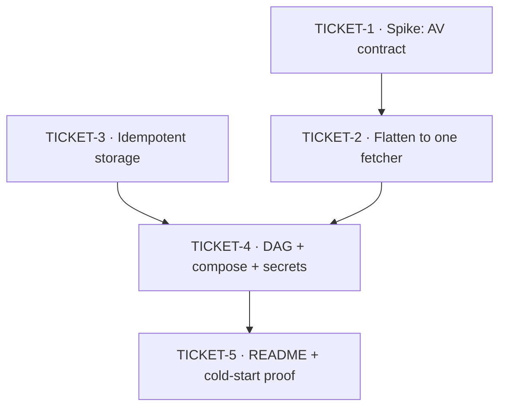

# Ticket Breakdown — Dockerized Stock Market Data Pipeline (slim)

**Sources:** [`dockerized-stock-pipeline.prd.md`](../../dockerized-stock-pipeline.prd.md) (intent) ·
[`architecture.md`](../../architecture.md) (approach — B, "flatten to the brief's nouns")
**Branch:** `assignment/slim-stock-pipeline` off `main` · **Tracker:** local (no Jira/Linear MCP configured)

## Epic summary

Cut MarketPipe to a single Alpha Vantage stocks path that a stranger can clone and run with one command plus one
pasted API key, restructured so the brief's four deliverables (`docker-compose.yaml`, DAG, fetching script,
`README.md`) are each a file the evaluator can point at. Mostly subtraction; the genuinely new code is the
idempotent upsert, the `OVERVIEW` parser, quota-exhaustion detection, and a partial-failure signal.

Today's tree: 886 lines of Python across `core/`, `custom/`, `utils/`, `dags/`, `tests/`; two Postgres
containers; dead Superset files; an orphaned broken `custom/api_client.py`; no unique constraint anywhere.

---

## Tickets

### TICKET-1 — Spike: capture the Alpha Vantage contract

**Blocking.** Timeboxed to 30 minutes. Answers the two open questions the whole error-handling design rests on.

- **Scope / acceptance criteria**
  - Register a free key; call `GLOBAL_QUOTE` and `OVERVIEW` for one symbol; save both payloads **verbatim** as
    JSON fixtures under `tests/fixtures/`.
  - Deliberately exhaust the quota; capture that response verbatim too. Record the HTTP status and the exact key
    (`Information`? `Note`?) that signals it.
  - Capture the response for a symbol that doesn't exist.
  - Confirm the current free-tier daily limit and whether `OVERVIEW` draws on the same budget.
  - Write findings to `docs/tickets/spike-alphavantage-findings.md`: limit, exhaustion shape, per-symbol call
    cost, and the go/no-go against the decision rule below.
- **Decision rule** — limit ≥ 25/day and `OVERVIEW` affordable at 2 calls × 3 symbols → proceed as specced.
  Tighter than 6 calls/day → cut the shipped symbol list, or revisit dropping `name`/`market_cap`. Exhaustion
  presents differently than assumed → TICKET-2's detection strategy changes before it is planned.
- **Per-ticket context:** architecture "Spikes & experiments" (Spike 1) · PRD §10 open questions 1–2 ·
  the current naive access at `core/stock_api_client.py:57` (`quote_data["Global Quote"]` → `KeyError` on quota).
- **Files touched:** `tests/fixtures/*.json` (new), `docs/tickets/spike-alphavantage-findings.md` (new).
- **Rough size:** ~150 lines, nearly all captured JSON. No production code.
- **Depends on:** none.

### TICKET-2 — Flatten the ingestion path to one fetcher

The demolition of the stock-side indirection plus the new fetching-script deliverable, in one slice — they touch
the same import graph, so splitting them leaves the tree broken in between.

- **Scope / acceptance criteria**
  - **Delete:** `core/crypto_api_client.py`, `core/base_api.py`, `core/data_processor.py`,
    `core/stock_api_client.py`, `custom/`, `docker/superset/`, `tests/test_crypto_api_client.py`,
    `tests/test_base_api_client.py`, `tests/test_data_processor.py`, `tests/test_stock_api_client.py`, and the
    `mock_imports`/`destroy_mock_imports`/`validate_symbols` helpers in `utils/`. Fix `utils/__init__.py`'s
    `import *` so `MagicMock` no longer leaks into the production namespace.
  - **Write `core/stock_fetcher.py`** — a flat module, no class hierarchy, no factory, no `pysertive`. Per
    symbol: `GLOBAL_QUOTE` + `OVERVIEW`, parse into
    `symbol · name · market_cap · volume · price · change_percent`.
  - **Three distinct, testable failure branches:** (a) symbol not found, (b) quota exhausted — detected from the
    body per TICKET-1's captured payload, **never** from status code, and explicitly *not* retryable,
    (c) network unreachable / `RequestException`.
  - **Failure posture: store the good, surface the bad.** A failing symbol does not block its peers. Return a
    result carrying both the successful rows and the per-symbol failures, with the symbol named in every log
    line — TICKET-4 turns that into a visible Airflow signal.
  - **Replace `mdp_config.json` with `config.json`**, slimmed to symbols + schedule only (no `clients`
    registry, no crypto). Adding a ticker stays a one-line edit — this is the scalability evidence.
  - **Tests** for parsing and all three failure branches, driven off TICKET-1's fixtures. No live network calls.
- **Per-ticket context:** architecture → "Recommended approach" (deleted-outright list), "Boundaries & contracts"
  (failure posture), "Other calls" (quota is first-class; retries belong to Airflow) · missing pieces #2, #3, #4 ·
  PRD MVP items 3–4 and 7, non-goals bullets 1, 3, 5.
- **Files touched:** `core/stock_fetcher.py` (new), `config.json` (new), `utils/*`, `tests/test_stock_fetcher.py`
  (new), plus the deletions above. **Does not touch** `requirements.txt`, `docker/`, `docker-compose.yaml`,
  `core/storage.py`, `database_setup/`, `dags/` — those belong to TICKET-3/4, which is what keeps this
  parallel-safe.
- **Rough size:** ~700–1000 lines changed (~40% tests), a large share of it deletion.
- **Depends on:** TICKET-1 (the quota-detection branch is planned against a real payload, not a guess).

### TICKET-3 — Idempotent storage: unique constraint + upsert

The PRD's "0 duplicate rows" metric has **no mechanism today** — `init.sql` has no unique constraint and
`storage.py` does a bare `INSERT`. This is new work, not a cut.

- **Scope / acceptance criteria**
  - `init.sql`: drop the `cryptos` table; add a unique constraint on `market_data.stocks (symbol,
    date_collected)`; create both the `airflow` and `market_data` databases so one Postgres container serves
    both (TICKET-4 wires the topology).
  - `core/storage.py`: `INSERT … ON CONFLICT (symbol, date_collected) DO UPDATE`. Re-triggering the same day
    updates in place. Drop the `table` parameter's dynamic-name plumbing — there is one table now.
  - Decide and apply the `volume INT` question (caps at ~2.1B): widen to `BIGINT` or record it as a known limit
    in the README backlog. Recommend widening — it is a one-word change.
  - **Tests:** insert-then-reinsert leaves `count(*)` unchanged and the row updated; a missing required field is
    rejected with the symbol named.
- **Per-ticket context:** architecture → "Data model" (idempotency), "What's actually there today" (rows 4) ·
  missing piece #1 · PRD success metrics rows "Re-running the same day's data" and MVP item 5 · open question on
  `volume INT`.
- **Files touched:** `database_setup/init.sql`, `core/storage.py`, `tests/test_storage.py`.
- **Rough size:** ~350–500 lines (~50% tests).
- **Depends on:** none — file-disjoint from TICKET-2, runs in parallel.

### TICKET-4 — One-command cold start: DAG, compose topology, secrets

Where the four deliverables actually become runnable together. Everything here is integration, so it waits for
both halves of the pipeline.

- **Scope / acceptance criteria**
  - **`dags/stock_data_dag.py`** replaces `dags/market_data_dag.py`. One DAG, stocks only — no
    `create_market_data_dag` factory, no crypto registration. Two-task chain **fetch → store**, so a fetch
    problem and a database problem light up different tasks in the UI.
  - **`start_date` becomes a fixed past date** (it is `datetime.now()` at parse time today — the drift
    antipattern), `catchup=False`, schedule daily from `config.json`, manual trigger works immediately.
  - **Retries belong to Airflow:** task-level `retries` with exponential backoff for transient network failure.
    A quota error must **not** be retried — retrying it just burns the quota.
  - **Surface "succeeded with omissions."** Pick the mechanism during implementation and prefer whatever reads
    clearly in the Airflow UI without a custom operator. The task must end visibly non-green when any symbol
    failed, while the successful symbols are still written.
  - **Compose slimming:** drop `postgres-airflow` (one Postgres, two databases), `airflow-triggerer` (nothing
    uses deferrable operators), the `airflow-cli` debug profile, and the `custom/` + `mdp_config.json` volume
    mounts. Remaining services: `postgres`, `airflow-init`, `airflow-webserver`, `airflow-scheduler`.
  - **Secret hygiene:** untrack `.env`, uncomment its `.gitignore` rule, ship `.env.example` with
    `ALPHA_API_KEY` and the DB credentials. Resolve the "scrub from history?" question — values are
    placeholders, so untracking going forward is defensible; say so in the commit message either way.
  - **Reconcile version pins:** drop the `apache-airflow==2.8.0` pin that contradicts the `apache/airflow:2.9.0`
    base image, move `requests` off the 2021 release, remove `pysertive` from both requirements files.
  - **Acceptance:** `docker compose up` from a clean tree reaches a green DAG run and rows in Postgres. Zero
    first-run task failures. A second trigger adds zero rows.
  - **Tests:** DAG imports cleanly, has the expected task ids and dependency edge, and `catchup` is off.
- **Per-ticket context:** architecture → "Other calls" (retries, compose topology, `start_date`), "Boundaries &
  contracts" (secrets, datastore) · missing pieces #4, #5 · PRD MVP items 1, 2, 6 and success-metric rows
  "First-run task failures", "Secrets in version control" · open question "How does 'succeeded with omissions'
  surface in Airflow?"
- **Files touched:** `dags/stock_data_dag.py` (new), `dags/market_data_dag.py` (deleted), `docker-compose.yaml`,
  `docker/airflow/Dockerfile`, `docker/airflow/requirements.txt`, `requirements.txt`, `.gitignore`,
  `.env.example` (new), `.env` (untracked), `tests/dags_test.py`.
- **Rough size:** ~500–800 lines.
- **Depends on:** TICKET-2 and TICKET-3.

### TICKET-5 — README and the cold-start proof (Spike 2)

The deliverable the whole PRD is actually betting on. Nothing here is optional — an unreadable README fails the
hypothesis even if every prior ticket passed.

- **Scope / acceptance criteria**
  - Rewrite `README.md` assuming **zero** prior knowledge: what it does, one-command run, the single manual step
    (paste one key into `.env`), where each of the four deliverables lives, how failures behave, and how to add
    a symbol.
  - Name the deliberate omissions as future work — CeleryExecutor, alerting, secrets manager, backfill.
  - **Resolve the diagram:** `assets/architecture.png` currently shows Superset and crypto. Redraw or remove —
    do not ship it stale.
  - **Resolve the CI question:** keep `.github/workflows/run_tests.yml` and `run_black.yml` plus
    `.pre-commit-config.yaml` **only if they pass green** against the slimmed tree; otherwise delete them.
    Passing workflows are code-quality evidence; red ones are the opposite.
  - **Run Spike 2 (this is the RIGHT/WRONG test):** clean the Docker cache, clone fresh, follow only the README,
    time it. Under 15 minutes to rows in Postgres. **Any question asked, or any file edited the README didn't
    specify, means the hypothesis failed — fix the README before submitting.**
  - Confirm the "substantive Python" count landed in the ~300–450 line band (`wc -l`, excluding tests). Below
    ~300 and the scalability/error-handling criteria have nothing left to point at.
- **Per-ticket context:** architecture → Spike 2 · PRD §4 hypothesis (RIGHT/WRONG conditions), §7 success
  metrics (all rows), §10 open questions on the diagram, the workflows, and the live demo.
- **Files touched:** `README.md`, `assets/architecture.png`, `.github/workflows/*`, `.pre-commit-config.yaml`.
- **Rough size:** ~250–400 lines, mostly prose.
- **Depends on:** TICKET-4.

---

## Dependency graph

## Suggested execution order

- **Wave 1 (parallel):** TICKET-1 · TICKET-3 — the spike is a 30-minute human-in-the-loop task, so storage work
  runs alongside it rather than idling behind it.
- **Wave 2:** TICKET-2 (after TICKET-1's payloads exist).
- **Wave 3:** TICKET-4 (after TICKET-2 **and** TICKET-3 are implemented, not merely planned).
- **Wave 4:** TICKET-5.

**Worktree note.** TICKET-2 and TICKET-3 are deliberately file-disjoint — the fetcher slice never touches
`storage.py`, `init.sql`, `requirements.txt`, `docker/`, or `dags/`, and the storage slice never touches the
client path. That is the only genuinely parallel pair; if you run them in separate worktrees
(`/worktree-create`), each validates independently and merges without conflict. Everything else is a chain, and
the epic is small enough that the chain is short.
